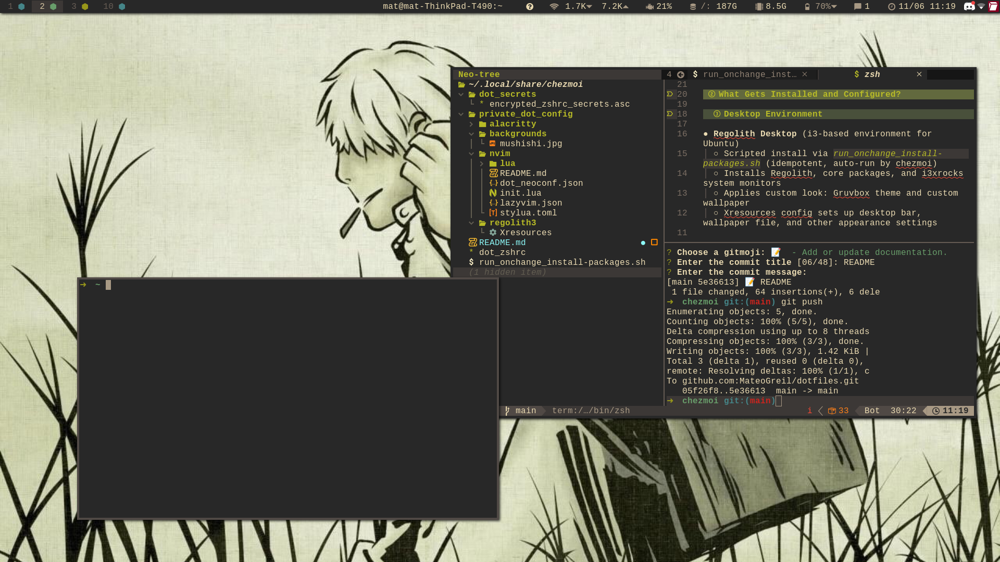

# dotfiles

This repository contains my dotfiles and configuration scripts for setting up a development environment on Ubuntu, primarily tailored for Regolith Desktop, Neovim (Lua-based configuration), and shell customization. It leverages [chezmoi](https://www.chezmoi.io/) for dotfile management.




## Installation (Quick Start)

1. **Install Ubuntu**  
   [Download Ubuntu Desktop](https://ubuntu.com/download/desktop) and install it.

2. **Install chezmoi and apply this dotfiles repo**
   ```sh
   sh -c "$(curl -fsLS get.chezmoi.io)" -- init --apply MateoGreil
   ```
   This will clone and install all configuration files and scripts in your home directory.

3. **Reboot** after install for desktop session and configs to take full effect.

## What Gets Installed and Configured?

### Desktop Environment

- **Regolith Desktop** (i3-based environment for Ubuntu)
  - Scripted install via `run_onchange_install-packages.sh` (idempotent, auto-run by chezmoi)
  - Installs Regolith, core packages, and i3xrocks system monitors
  - Applies custom look: Gruvbox theme and custom wallpaper
  - Xresources config sets up desktop bar, wallpaper file, and other appearance settings

### Shell

- **Zsh** setup with Oh My Zsh:
  - Theme: `robbyrussell`
  - Custom options and plugin comments in `.zshrc`

### Neovim

- **Neovim**
  - Scripted install via `run_onchange_install-packages.sh` (idempotent, auto-run by chezmoi)
  - Uses [LazyVim](https://www.lazyvim.org/) framework
  - Plugin management via `lazy.nvim` ([folke/lazy.nvim](https://github.com/folke/lazy.nvim))
  - Custom keymaps for navigation, window resizing, clipboard integration, and more
  - Options and appearance tweaks (see `lua/config/options.lua`)
  - Gruvbox themed (set to 120)

### Other System and package dependencies (from scripts):

- **APT Updates** via `run_onchange_install-packages.sh`
- Miscellaneous utilities as needed (see `run_onchange_install-packages.sh`)

## Customization

After running chezmoi:
- Modify Neovim configs in `.config/nvim/`
- Change Regolith settings in `.config/regolith3/Xresources` and wallpaper
- Update shell environment via `.zshrc`

Don't forget to update chezmoi with `chezmoi add <file>`, `chezmoi cd` and add to git the diffs

## Notes

- This setup expects to run on **Ubuntu** only; it will exit on other systems.
- Scripts and configs are idempotent: safe to re-run when updating.

## References

- [chezmoi documentation](https://www.chezmoi.io/docs/)
- [Regolith Desktop](https://regolith-desktop.com/)
- [LazyVim](https://www.lazyvim.org/)
- [Avante.nvim](https://github.com/yetone/avante.nvim)
